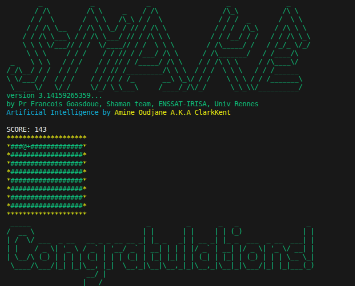

# IA pour le jeu Snake - Amine
Bienvenue sur le dépôt du projet IA Snake. Ce projet scolaire démontre mes compétences en C. 
L'IA analyse le plateau à chaque tour pour prendre la meilleure décision :

* Elle évite les murs et son propre corps.

* Elle calcule le chemin le plus court vers le bonus. 
    
* Elle essaie de toujours garder une issue de secours pour ne pas se coincer dans un cul-de-sac. 

## Technologies Utilisées
* **C**

## Informations pratiques

* OudjaneAmine.c : Le cœur du projet.
* snake-*-*.o : Moteur de jeu pré-compilé (librairie statique) pour différentes architectures.
* level-10x5.map : Exemple de carte pour le jeu.

## Comment lancer le projet ?

Le projet utilise un Makefile pour faciliter la compilation. Par défaut, le Makefile est configuré pour Linux (Intel/AMD). Si vous êtes sur cette architecture, lancez simplement :

        Make

### Note pour macOS ou architecture ARM (M1/M2/Raspberry) : 
Si vous n'êtes pas sur un PC Linux standard, ouvrez le fichier Makefile et décommentez la ligne correspondant à votre système (ex: snake-arm-macos.o) avant de lancer make.
    

👤 Auteur :

Amine 

